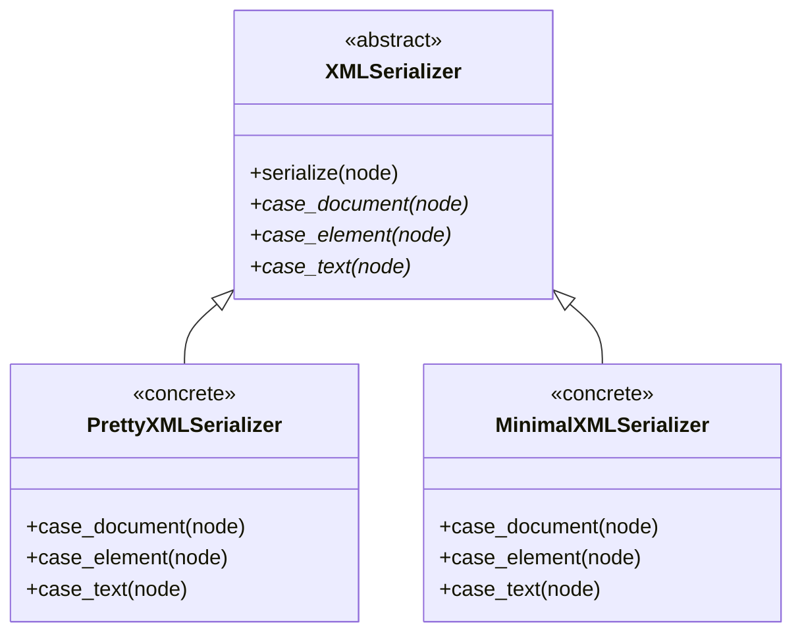

# Template Method Pattern — XMLSerializer UML

## Legend

| Role | Class / Method |
|------|----------------|
| **Abstract class** | `XMLSerializer` |
| **Concrete classes** | `PrettyXMLSerializer`, `MinimalXMLSerializer` |
| **Template method** | `serialize(dom::Node *node)` — defines the algorithm and calls the primitives |
| **Primitive methods** | `case_document`, `case_element`, `case_text` — abstract in base, implemented in concrete classes |
